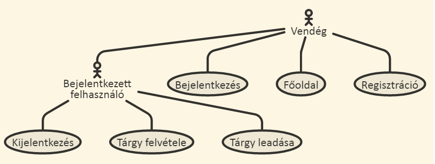

**A teljes dokumentáció pótlása.**

# Követelményanalízis

**Ez egy egyszerű, kezdetleges mini Neptun oldal.**

Regisztráció után a felhasználó bejelentkezhet, tárgyakat hozhat létre, illetve felveheti az adott tárgyakat, majd kijelentkezhet.

A tárgyaknak be lehet állítani krediteket is amiket a tárgy elvégzéséért kap a tanuló. A tárgyakat ahogy fel lehet venni, úgy le is lehet adni, a tárgyak között lehet böngészni is.

## Funkcionális követelmények

* Legyen lehetőség regisztrációra
* Regisztrálást követően a felhasználó be tudjon lépni, illetve ki tudjon jelentkezni.
* Bejelentkezés után tárgyak felvétele és leadása

## Nem funkcionális követelmények

* Felhasználóbarát
* Ergonomikus
* Gyors

## Use-case modell 

# Tervezés

## Oldaltérkép

* Főoldal
* Regisztráció
* Bejelentkezés

### Bejelentkezett felhasználóknak
* Tárgy létrehozása 
   * kredit beállítása
* Tárgy felvétele
* Tárgy leadása
* Kijelentkezés

# Implementáció

## Fejlesztőkörnyezet

### Felhasznált eszközök

* Git verziókezelő
* Node.js Javascript környezet
* AdonisJS MVC keretrendszer
* Github a projekt közzétételéhez

### Fejlesztőkörnyezet felállítása

1. Git verziókezelő telepítése
2. Node.js környezet telepítése
3. Projekt klónozása lokális gépre: git clone https://github.com/bodand94/BKOARQ.git 
4. A projektkönyvtárban a függőségek telepítése: npm i
5. .env.example másolása, majd átnevezése .env-re, és tartalmának ellenőrzése
6.	App indítása: npm start vagy npm run dev 
7. express-admin webszolgáltatás:
   1. Telepítés: npm i express-admin 
   2. Konfigurálás / indítás: npm run sqladmin 
      o Adatbázis típusa: sqlite 
      o Adatbázisfájl: database/db.sqlite 
      
## Könyvtárstruktúra
* app Alkalmazás logika 
  * Commands ace parancsok
  * Http HTTP specifikus alkalmazás logika 
    * Controllers HTTP kérések kezelése
    * Middleware HTTP kérések kezelése előtt végrehajtandó
  * Listeners Bejövő kérések figyelése
  * Model Modell osztályok, logika, működés 
    * Services Komponensek
    * Traits Modellek kiterjesztése
* bootstrap Az app indulásához szükséges műveletek, konfigurációk
* config Az app működését befolyásoló konfigurációs fájlok
* database Adatbázissal kapcsolatos 
  * migrations Adatbázis migrációk, séma meghatározása
  * seeds Adatbázis seederek, példa/tesztadatok beszúrása
* providers Providerek
* public A webszerver által közvetlenül kiszolgált fájlok
* resources Az app által felhasznált egyéb fájlok 
  * views Nunjucks template fájlok

# Felhasználói dokumentáció

## Regisztráció, bejelentkezés

**Regisztrációhoz** kattints a jobb felső sarokban a Regisztráció lehetőségre. Az űrlap elküldése után tag vagy az oldalon, és automatikusan bejelentkeztet a rendszer, így el is kezdhetsz  tárgyakat felvenni. Regisztrációkor a neved és e-mail címed kötelező megadni, illetve választanod kell egy jelszót, melyet később a bejelentkezéshez használsz.

Ha esetleg nem vagy belépve, akkor a jobb felső sarokban lévő Login lehetőséget választva **beléphetsz**.
**A belépést követően** lehetőség van tárgyak létrehozására és felvételére,  azok leadására illetve kijelentkezésre.
